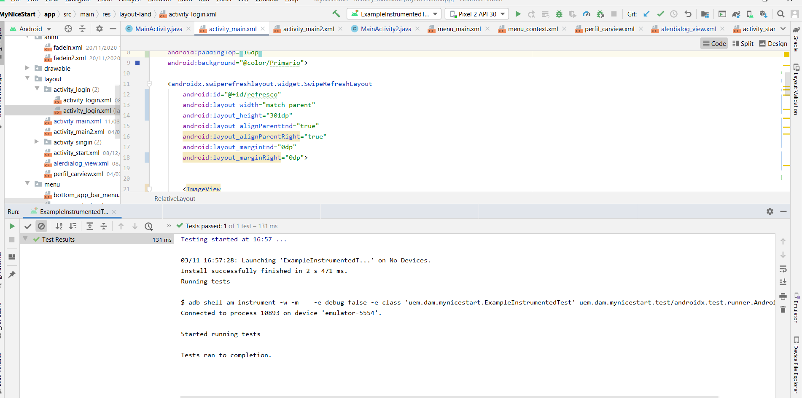

# MyNiceStart

5 Ventanas de la aplicacion MyNiceStart

* Splash
    El splash nos muestra el logo de la aplicaccion girando al ritmo de la musica
* Login
    En el login puedes meter tu usuario y contraseña lo que te permite acceder a la aplicacion
* Signin
    En el caso de que aun no tuvieras usuario y contraseña aqui podras darte de alta en la aplicacion

Splash | Login | Signin
-------|-------|-------
 |  | 

*Main1
Aqui por ahora tenemos un boton que nos desplaza a la main2

*Main2
Aqui encontraremos una imagen con unos tips acerca de la postura a la hora de dormir
Main1 | Main2
-------|-------
 | 

AlertDialog | Context | Busqueda | Expandible | MenuBar | Swipe
------------|---------|----------|------------|---------|
 |  |  |  |  | 

Instrument

